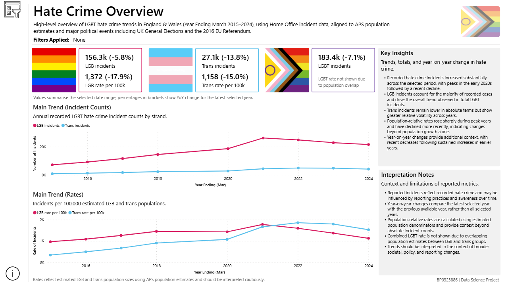
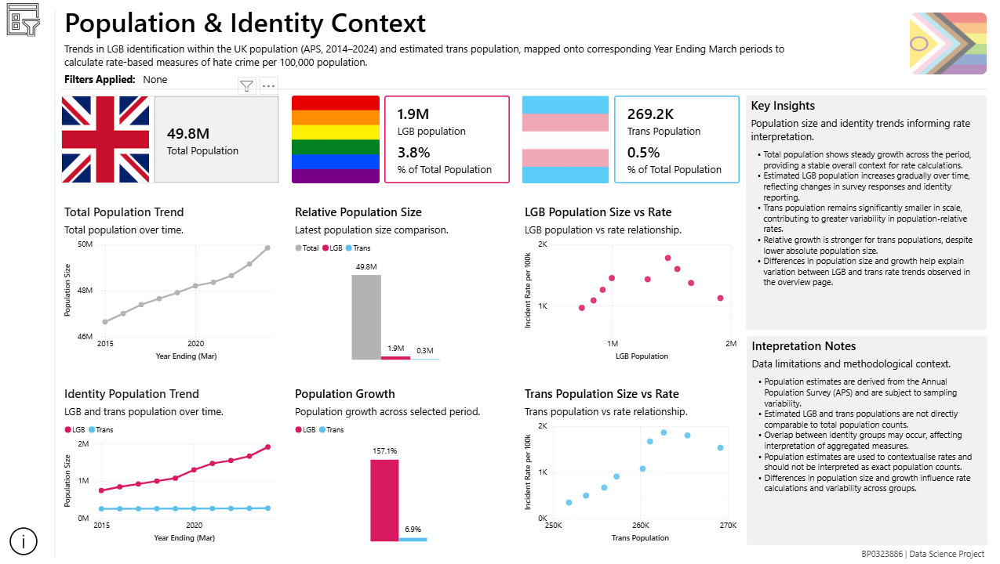
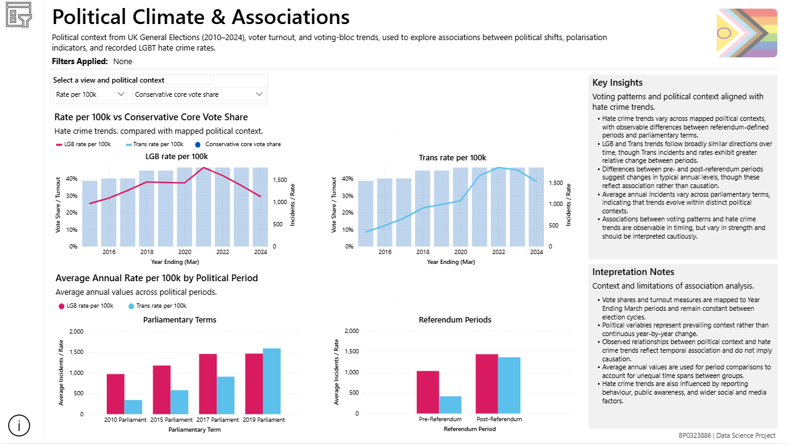
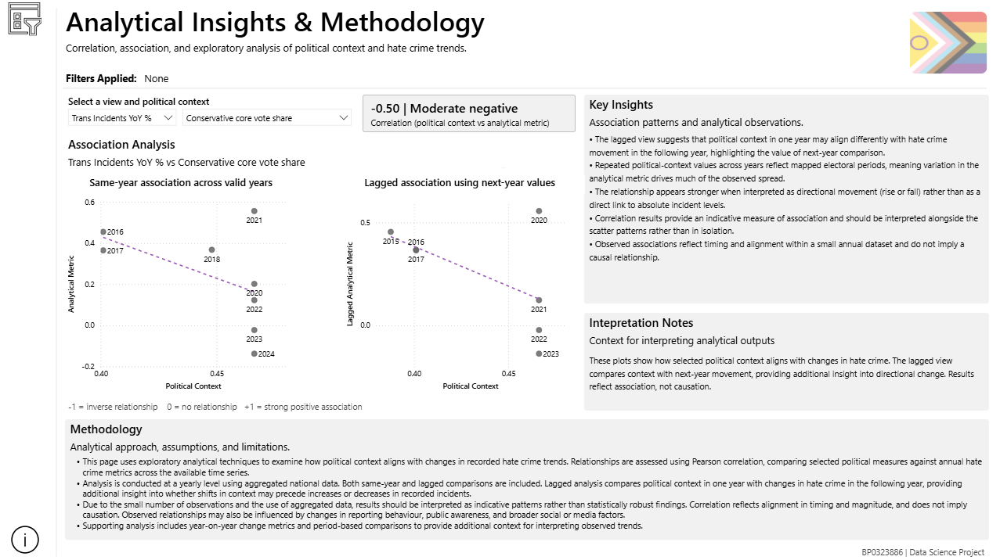
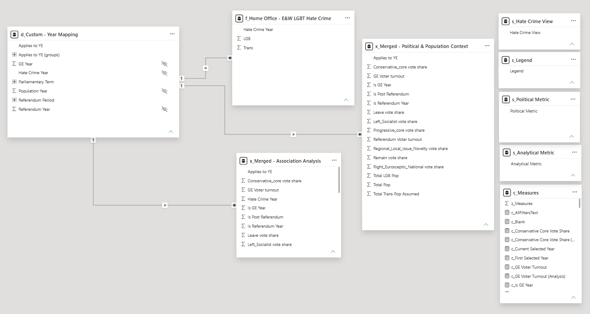

  

# 🌈 Project 01: LGBT Hate Crime Insights

## 📝 Project Summary

This project develops an interactive analytical dashboard examining police-recorded LGBT hate crime trends in England and Wales between YE March 2015 and YE March 2024.

The dashboard integrates:
- hate crime statistics
- demographic context
- major uk political events

The purpose is to explore whether recorded LGBT hate crime trends exhibit temporal patterns or statistical associations with national voting behaviour and politically significant events.

This analysis is explicitly associational rather than causal.

## 🎯 Why this matters

This project demonstrates how publicaly available data can be integrated to provide a more contextualised understanding of sensitive social trends.

By combining crime, demographic, and political datasets, the dashboard enables more informed intepretation of patterns that would not be visible through single-source analysis alone.

The work highlights how exploratory analytics can support responsible discussion and evidence-based insight without overstating causality.

## 🔍 Key Insights

- LGBT hate crime increased through early 2020s before declining
- LGB incidents drive overall trends; Trans incidents show greater volatility
- Population-adjusted rates reveak sharper movement than counts alone
- Lagged analysis suggests political context aligns differently with next-year changes

## ⚙️ Key Features

- Interactive Power BI dashboard
- Trend analysis across sexual orientation and transgender hate crime strands.
- Population-normalised rate analysis
- Political context integration
- Transparent methodology and limitations

## 📁 Project Structure

- ./docs/project-summary.md
- ./docs/methodology.md
- ./docs/references.md
- ./data/
- ./images/

## 📊 Dashboard Overview

### 🧭 Overview

### 👥 Population Context

### 🗳️ Political Context

### 📈 Analytical Insights

### 🧩 Model

The model follows a star schema design, with a dedicated analysis table to support correlation and scatter-based analysis.

## 🛠️ Tools Used

- Power BI
- Power Query
- DAX

## 🗒️ Notes

- All data used in this project is publicly available.
- The analysis is exploratory and associational.
- No confidential or personal data is included.
